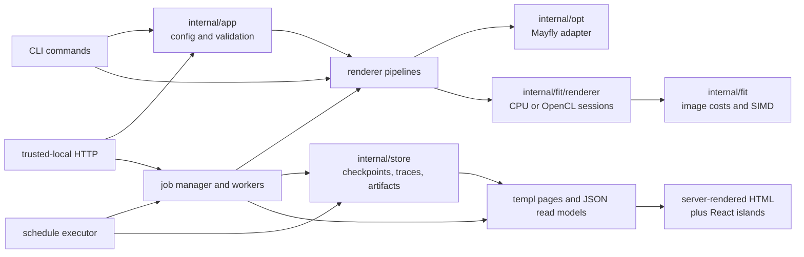

# Architecture

MayFlyCircleFit is one Go program with three user-facing workflows: a direct
CLI run, a trusted-local HTTP server, and durable multi-stage schedules. They
share the same typed configuration, renderer/optimizer contracts, pipeline
implementations, and filesystem persistence.

This document explains ownership and dependency direction. Observable edge
cases are specified in
[`behavior-invariants.md`](behavior-invariants.md); renderer math and SIMD
dispatch are specified in
[`rendering-internals.md`](rendering-internals.md).

## System shape

Dependencies point toward lower-level contracts. In particular,
`internal/store` reuses the canonical `internal/app` types rather than defining
application configuration of its own, never imports `internal/server`, and the
cgo OpenCL package does not import the assembly-bearing renderer package.

## Package responsibilities

| Package | Owns | Does not own |
| --- | --- | --- |
| `cmd` | Cobra commands, flag binding, process-facing output and exit classification | Independent defaults or validation rules |
| `internal/app` | Typed configuration, defaults, limits, schedule documents, seed resolution | Rendering, HTTP, or filesystem persistence |
| `internal/fit` | Image objectives and architecture-specific SSD/SAD dispatch | Optimizer lifecycle or application configuration |
| `internal/fit/renderer` | CPU rendering, backend adapters, sessions, joint/sequential/batch pipelines, polishing | Job state or artifact paths |
| `internal/fit/renderer/opencl` | cgo OpenCL device state, kernels, buffers, and readback | CPU renderer imports or server policy |
| `internal/opt` | Optimizer interface and MayFly v0.6.0 adapter | Rendering semantics |
| `internal/server` | Trusted-local HTTP boundary, jobs/workers, schedules, SSE, and UI read models | Artifact file layout |
| `internal/store` | Checkpoint, trace, schedule, metadata-index, and artifact ownership | CLI/API defaulting |
| `internal/ui` | templ sources, generated Go, and embedded static assets | Authoritative live browser state |
| `web` | TypeScript/React islands and browser tests | Runtime dependency installation |

## Configuration enters once

CLI flags, JSON requests, form submissions, schedules, and checkpoints converge
on `internal/app` types. Normalization/defaulting and validation occur before a
worker or pipeline is created. This prevents one surface from silently accepting
a value another rejects.

Omitted and explicit zero values are not interchangeable. JSON and schedule
parsers preserve field presence so an explicit invalid zero is rejected instead
of replaced with a default. CLI flags always have a value; only flags whose
contract defines zero as “choose automatically” resolve later. A user seed of
zero is such a sentinel and produces a reported effective seed.

Persistence keeps compatibility aliases at its boundary, but canonical
configuration remains in `internal/app`; moving application policy into the
store would reverse the intended dependency direction.

## Optimization and rendering

`renderer.Renderer` is the minimum objective-facing interface: render a flat
seven-values-per-circle vector, compute its cost, expose dimensionality/bounds,
and return the reference image. Pipelines add private capabilities through
interfaces rather than backend type checks:

- `rendererSessionFactory` creates an independent same-backend session for a
  requested circle count;
- the staged session factory starts from an accumulated canvas when the backend
  can do so;
- concurrent-evaluation capability is advertised separately from session
  creation, because a backend may support sequential stages without supporting
  simultaneous sessions.

The three pipelines have different ownership:

- **Joint** optimizes the complete parameter vector in one session.
- **Sequential** retains the accepted canvas and optimizes one new circle per
  stage.
- **Batch** retains the accepted canvas and optimizes up to `batchSize` new
  circles, with a smaller final batch. A batch that improves the image is kept
  whole, weak circles included; only a batch nothing can be kept from is
  refilled, and refills draw on the run's own iteration budget rather than
  minting a further one.

All modes preserve the selected backend and starting canvas. A backend that
cannot honor a required session capability returns an explicit unsupported
error; it must not silently switch to CPU or a white canvas.

The CPU renderer has two competing forms of parallelism. `--threads` shards the
rows of one render, while `--parallel-evaluation` leases independent,
single-threaded sessions to score several optimizer candidates. They consume
the same cores and are not additive. Polishing uses the same pool shape while
keeping final sweep acceptance serial and transactional. See
[`polishing-throughput-report.md`](polishing-throughput-report.md) and
[`parallel-evaluation-report.md`](parallel-evaluation-report.md).

### Why OpenCL is a separate package

Go does not allow Plan 9 assembly in a package that uses cgo. The CPU SIMD
kernels therefore stay in `internal/fit/renderer`, while OpenCL lives in
`internal/fit/renderer/opencl`. A gpu-tagged adapter in the parent package
constructs the OpenCL renderer, supplies its CPU fallback, and implements the
private session interface that another package cannot name.

OpenCL is experimental. It supports joint, sequential, and batch execution by
creating same-backend sessions and replaying retained circles, but it does not
support a custom accumulated canvas and does not advertise concurrent
evaluation. Device-resource sharing and vendor-GPU characterization remain
open work.

## Server lifecycle

`serve` is trusted-local software, not a multi-user internet service. The HTTP
boundary enforces loopback-oriented binding, same-origin browser mutations,
bounded request/image/job resources, configured input roots, and disabled-by-
default profiling. It has no authentication or TLS.

A job moves through typed lifecycle states managed by `JobManager`. Callers
receive immutable snapshots rather than pointers to live optimizer state. A
worker owns the optimizer, renderer sessions, checkpoint cadence, and terminal
transition. Progress snapshots flow to the manager and broadcasters; artifact
rendering never borrows the objective's mutable renderer.

Completion ordering matters:

1. record the final measured result while the job is still running;
2. write the final checkpoint and artifacts;
3. publish the terminal state and terminal event.

This makes a normally completed job continuable. If the final write fails, the
job records that persistence error and any continuation falls back to the last
valid periodic checkpoint or is refused.

Two SSE surfaces serve different consumers:

- job-specific and global progress streams are compatibility APIs for live
  optimizer snapshots;
- `/api/v1/events` is the browser's ordered invalidation stream. REST remains
  authoritative, so islands refetch after connection, gaps, focus changes, and
  a safety interval instead of treating SSE as durable state.

## Persistence and continuation

`internal/store` owns the on-disk layout and uses contained identifiers,
restrictive permissions, validated schemas, and atomic replacement for durable
documents. The main records are:

- `checkpoint.json` plus rendered artifacts for restart-from-best;
- compact `checkpoint-info.json` projections for listings, avoiding parameter
  vectors during scans;
- append-oriented `trace.jsonl` metric history;
- schedule documents and per-stage records.

Resume is deliberately restart-from-best, not a suspended optimizer. Mayfly's
population/internal state is not serialized; a new deterministic continuation
population is seeded around the saved best. Sequential and batch server jobs
cannot be resumed as exact in-progress staged pipelines.

A completed CPU batch extension can reuse the parent's verified `best.png` as
its immutable retained canvas. This is a hot-path cache, not independent state:
the checkpoint still owns the parameters and cost, and any absent or mismatched
image falls back to rendering those parameters.

## Schedules and campaigns

A schedule is a persisted plan executed by the server, not a second optimizer.
Each base, extend, or polish stage becomes an ordinary job and therefore shares
the same admission limits, worker path, checkpoints, and renderer semantics as
a manually submitted job.

Per-stage records are the sole progress cursor. A stage record is written before
its job starts, so restart can adopt a completed attempt or rerun only the
interrupted attempt. Pause takes effect at a stage boundary; cancel also
cancels the in-flight job. Conditional polish policy is recomputed from durable
stage outcomes rather than from a separate mutable counter.

Campaign pages and CLI output are projections over schedules or checkpoint
lineage. Collection responses deliberately omit full `JobConfig` and parameter
vectors so every legal 4,096-stage campaign remains below the bounded CLI
response size. Full stage configuration is retrieved one stage at a time. See
[`schedule-format.md`](schedule-format.md).

## Web UI

templ renders complete HTML for the dashboard, jobs, campaigns, and detail
pages. That markup is both the no-JavaScript fallback and the hydration seed.
React islands add charts, live actions, pagination, and reconciliation; they do
not create a second server-side state model.

The JSON embedded in a page and the corresponding REST response use the same
projection shape. After mount, an island updates the existing state rather than
reconstructing it from DOM text. Shared chart code resolves colors from CSS
custom properties, listens for both explicit theme changes and system-theme
changes, and updates each Chart.js instance in place rather than reallocating a
canvas for every event. The job and campaign pages share one image-viewer
component, so reference/best/difference/overlay behavior has one contract.

The frontend build has two distinct phases:

1. npm supplies TypeScript dependency files and tests during development/CI;
2. the pinned Go esbuild tool produces a deterministic bundle committed under
   `internal/ui/static` and served from `go:embed`.

Consequently, ordinary `go build ./...` requires neither node nor npm. Changes
to `.templ` files require committed generated Go; changes to `web` require a
committed bundle. `just check` verifies both drift boundaries.

## Where contracts live

- [`behavior-invariants.md`](behavior-invariants.md): backend/mode behavior,
  determinism, browser reconciliation, job completion, and schedules.
- [`rendering-internals.md`](rendering-internals.md): CPU geometry,
  compositing, SSD kernels, and SIMD dispatch.
- [`support-matrix.md`](support-matrix.md): platform/backend claims.
- [`known-limitations.md`](known-limitations.md): unsupported and experimental
  behavior.
- [`releasing.md`](releasing.md): generated assets, CI gates, and publication.
