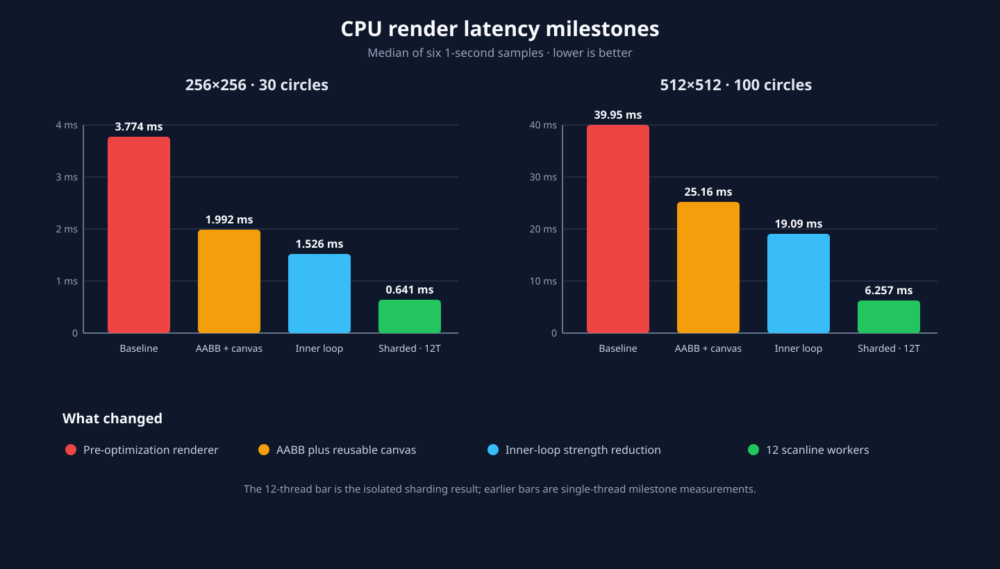
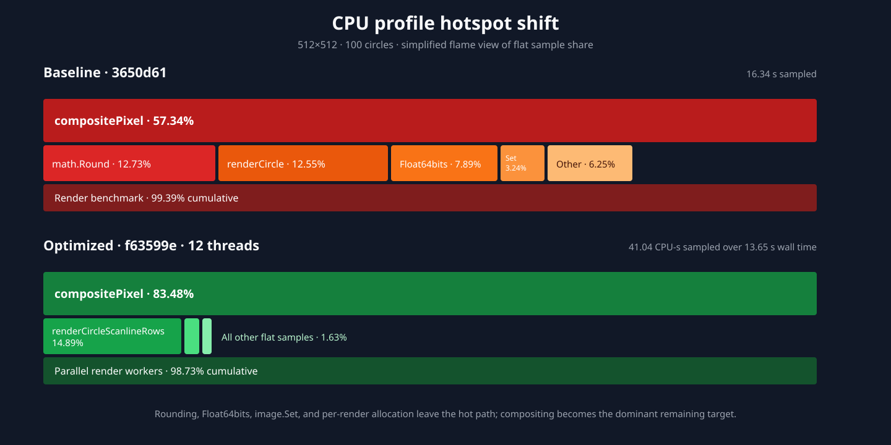

# CPU performance history

The measured milestones of the CPU rendering and evaluation path, from the
pre-optimization renderer through the SIMD tiers, span compositing, and fixed-
point geometry. It is the record of *what was gained and where*, kept so a
future change has a baseline to argue against.

> **Timings are machine-specific.** Every number here is qualified by host,
> date, and revision. Do not compare a figure from one host against a figure
> from another, and do not compare any of them against a fresh run on a
> different machine — re-measure instead. Other reports
> ([`parallel-evaluation-report.md`](parallel-evaluation-report.md),
> [`contiguous-window-polish-report.md`](contiguous-window-polish-report.md))
> point here for exactly this caveat.

For how the current code works, read
[`rendering-internals.md`](rendering-internals.md). For what was tried and
rejected, read [`rejected-optimizations.md`](rejected-optimizations.md). For
how to run the benchmarks yourself, read [`benchmarks.md`](benchmarks.md).

## Hosts

| Label | Machine |
| --- | --- |
| **Ryzen** | AMD Ryzen 5 4600H, 6 cores / 12 logical CPUs, Linux/amd64, AVX2 |
| **M5** | Apple M5 MacBook Air, macOS 26.6.1, ARM64, ASIMD |

## Renderer latency milestones

Measured 2026-08-12 on **Ryzen**, Go 1.26.0, `GOMAXPROCS=1` for the
single-thread rows. Six calibrated one-second samples per point, medians,
`benchstat` for significance. Each milestone was benchmarked in a detached
worktree at the named commit using the same deterministic renderer benchmark.

| Milestone | Revision | 256×256/K30 | vs baseline | 512×512/K100 | vs baseline | Allocs/render |
| --- | --- | ---: | ---: | ---: | ---: | ---: |
| Pre-optimization baseline | `3650d61` | 3.774 ms | 1.00× | 39.95 ms | 1.00× | 2 |
| AABB reject + reusable canvas | `df0bc0c` | 1.992 ms | 1.89× | 25.16 ms | 1.59× | 0 |
| Inner-loop strength reduction | `9dfd58d` | 1.526 ms | **2.47×** | 19.09 ms | **2.09×** | 0 |
| Mature single-thread scanline | `98babd0` | 1.437 ms | 2.63× | 18.62 ms | 2.15× | 0 |
| Scanline sharding, one thread | `c53085a` | 1.470 ms | 2.57× | 18.53 ms | 2.16× | 0 |

Both reductions against baseline are significant at `p=0.002`. The serial path
before and after sharding is statistically unchanged (`p=0.485`, `p=0.699`):
adding parallel support did not regress it.

With twelve scanline workers on the same host:

| Workload | One thread | 12 threads | Parallel | End-to-end vs baseline |
| --- | ---: | ---: | ---: | ---: |
| 256×256/K30 | 1.470 ms | 0.641 ms | 2.29× | **5.89×** |
| 512×512/K100 | 18.53 ms | 6.257 ms | 2.96× | **6.39×** |

The twelve-thread path pays twelve small scheduling allocations (720 B/render in
the isolated benchmark). Worthwhile for medium and large workloads, wrong for
tiny ones — see [`cpu-rendering-threads.md`](cpu-rendering-threads.md).

Allocations went from 262,210 B/render at 256×256 (≈1.00 MiB at 512×512) to
0 B/op and 0 allocs/op in the timed region: a measured 100% hot-path reduction,
and the reason the renderer owns one reusable canvas today.

### What each change bought

| Change | Measured conclusion |
| --- | --- |
| AABB precomputation, exact-zero-opacity reject, cheaper rounding | 1.42× on its contemporaneous optimizer workload. Removed `math.Round` (12.73% of baseline flat samples) and `math.Float64bits` (7.89%) from the profile entirely. |
| Reusable canvas with a cached background | 1.065× wall clock, 98.1% fewer allocations, later confirmed as 0 allocs/op. Memory was never the CPU bottleneck; this shipped for the allocation profile, not the clock. |
| Cache-layout analysis | **No change.** Array-of-structures already matches the all-fields-per-circle access pattern. See [`rejected-optimizations.md`](rejected-optimizations.md). |
| Reciprocal multiplication, CSE, offset inlining | 1.31× at 256×256 and 1.32× at 512×512 over the previous milestone. Compositing was division-bound at seven divisions per pixel; it is now one. |
| Disjoint scanline sharding | 2.29× / 2.96× with twelve workers; serial path unchanged. |

The historical per-change figures were taken on optimizer runs rather than the
renderer microbenchmark, so they are labelled historical and are not mixed into
the same-host table above.

### Profile shift

Matched 512×512/K100 profiles, ten seconds each, on **Ryzen**. Baseline ran at
45.13 ms/render; the twelve-thread current profile at 8.60 ms/render under
profiling.

| Flat CPU hotspot | Baseline | After | Direction |
| --- | ---: | ---: | --- |
| `compositePixel` | 57.34% | 83.48% | Larger share of a much faster render — and the reason SIMD work then targeted the compositor |
| Circle traversal / rasterization | 12.55% | 14.89% | Secondary |
| `math.Round` | 12.73% | — | Eliminated |
| `math.Float64bits` | 7.89% | — | Eliminated |
| `image.NRGBA.Set` | 3.24% | — | Direct buffer access removed it |

Self-contained interactive captures: [baseline
flamegraph](profiles/phase9-baseline-flamegraph.html) and [optimized
flamegraph](profiles/phase9-optimized-flamegraph.html). They embed sampled
stacks, not the raw binary profile.

## SSD kernel throughput

Validated 2026-08-12. Five samples per case at 500 ms; medians. Every case
reports 0 B/op and 0 allocs/op, confirming the Plan 9 assembly dispatch adds no
cgo or GC pressure.

**Ryzen — scalar vs AVX2**

| Size | Scalar | AVX2 | Speedup |
| --- | ---: | ---: | ---: |
| 64×64 | 393.7 Mpx/s | 2,475 Mpx/s | 6.3× |
| 128×128 | 410.8 Mpx/s | 2,562 Mpx/s | 6.2× |
| 256×256 | 416.6 Mpx/s | 2,501 Mpx/s | 6.0× |
| 512×512 | 405.5 Mpx/s | 2,419 Mpx/s | 6.0× |
| 1024×1024 | 384.2 Mpx/s | 1,325 Mpx/s | 3.4× |

**M5 — scalar vs NEON**

| Size | Scalar | NEON | Speedup |
| --- | ---: | ---: | ---: |
| 64×64 | 1,336 Mpx/s | 6,950 Mpx/s | 5.2× |
| 256×256 | 1,330 Mpx/s | 6,906 Mpx/s | 5.2× |
| 1024×1024 | 1,313 Mpx/s | 6,851 Mpx/s | 5.2× |

AVX2 throughput falls about 45% at 1024×1024, where the two interleaved NRGBA
inputs reach an 8 MiB working set — a cache boundary, not dispatch overhead. The
M5 curve is flat to within 1.5% across the whole matrix, so no equivalent cliff
appears there.

Hardware cache-miss counters were deliberately *not* obtained: the Linux host
runs `perf_event_paranoid=4` and the MacBook has no Instruments template
installed. No security setting was weakened for a benchmark; the throughput
curve is the evidence, and no miss counts are claimed.

The scalar kernel itself was tuned before any SIMD work: unrolled-4 with int32
differences and a single float64 conversion is ~1.8× the naive per-pixel cost
function, and the kernel is compute- and dependency-bound rather than
memory-bound (~7% of DDR4 bandwidth) — which is what made multi-accumulator SIMD
the right next step.

### The SSE2 tier

Validated 2026-08-16 on a 64-vCPU QEMU guest that reports SSE2 through SSE4.2
and no AVX2 — a host that *genuinely* lacks AVX2, not an AVX2 machine under
`GODEBUG=cpu.avx2=off`, which has the right instruction set and the wrong
microarchitecture. Before this tier, such a host lost the entire vector speedup
rather than part of it. Medians of three 300 ms runs, 0 allocs throughout.

Where the time went with no AVX2, profiled before the SSE2 kernels existed:
`ssdScalar` 29.96%, `compositeOpaqueSpanScalar` 25.17%, `MSECost` 24.63%,
`fixedCircleQ16.span` 2.80%. Three symbols hold about 80% of the profile, which
is what scoped the work to SSD and delta-SSD.

| Image | Scalar | SSE2 | Speedup |
| --- | ---: | ---: | ---: |
| 64×64 | 6622 ns | 1099 ns | 6.03× |
| 256×256 | 105222 ns | 16928 ns | 6.22× |
| 1024×1024 | 1698357 ns | 318398 ns | 5.33× |

Delta-SSD over dirty spans, with the int32 accumulator:

| Span | Scalar | SSE2 | Speedup |
| --- | ---: | ---: | ---: |
| 4 px | 10.2 ns | 4.5 ns | 2.25× |
| 16 px | 35.1 ns | 9.4 ns | 3.75× |
| 64 px | 135.3 ns | 31.6 ns | 4.28× |
| 256 px | 546.2 ns | 122.8 ns | 4.45× |

End to end on the same target:

| Case | before | after | Speedup |
| --- | ---: | ---: | ---: |
| Cost/256×256/FastMSE | 107351 ns | 18353 ns | 5.85× |
| Cost/512×512/FastMSE | 423615 ns | 69197 ns | 6.12× |
| Pipeline/Sequential/K4 | 11857282 ns | 9573929 ns | 1.24× |
| Pipeline/Batch/K6/B2 | 14821269 ns | 12343750 ns | 1.20× |
| Pipeline/Joint/K8 | 7906113 ns | 6966160 ns | 1.13× |

The cost figures track the microbenchmark; the pipeline figures are far smaller
because the optimizer, allocation, and the span compositor were unchanged at
that point, and Amdahl applies.

**The accumulator is the design choice worth restating.** Partial sums stay in
int32 lanes and widen to int64 once at the epilogue; widening per iteration
measured materially slower. The delta kernel initially got this wrong — it was a
transliteration of the AVX2 kernel and widened per iteration, spending sixteen
extra instructions per four pixels. Fixing it was worth 1.11×–1.45× over spans
of eight pixels and up. It survived that long because `BenchmarkDeltaSSDSpan`
times only the *installed* kernel, so on an AVX2 development machine the SSE2
kernel could not be measured at all. A direct benchmark now exists for each
kernel.

## Cost integration: why SSD speed was not the answer

Validated 2026-08-12 on **Ryzen**, AVX2 active. `FastMSECost` became the
renderer default for both constructors, with `MSECost` kept as the readable
oracle and the `SetCostFunc` / `UseFastCost` opt-out.

| Workload | `MSECost` | `FastMSECost` | Speedup |
| --- | ---: | ---: | ---: |
| Direct 64×64 | 17.90 µs | 1.97 µs | 9.1× |
| Direct 256×256 | 496.00 µs | 27.11 µs | 18.3× |
| Direct 512×512 | 1.18 ms | 112.64 µs | 10.5× |
| Full cost 64×64/K10 | 65.33 µs | 50.50 µs | 1.29× |
| Full cost 256×256/K50 | 3.89 ms | 3.79 ms | 1.03× |
| Full cost 512×512/K100 | 29.78 ms | 28.29 ms | 1.05× |

**This is the measurement that redirected the whole effort.** A 9–18× faster
cost function moves the end-to-end number by 1.03–1.29×, because compositing
dominates. A later one-thread 512×512/K100 production profile put SSD at 0.60%
of samples against 84% for compositing. Everything after this targeted the
compositor and the geometry walk, not the cost kernel.

## Span compositing

Validated 2026-08-12 on **M5**. Opaque NRGBA canvases composite a whole scanline
span at a time, hoisting the foreground and blend terms out of the pixel loop.

| 512×512/K100 path | Median | Speedup | Allocs |
| --- | ---: | ---: | ---: |
| Previous per-pixel loop | 3.883 ms | 1.00× | 0 |
| Horizontal span, automatic NEON dispatch | 2.015 ms | **1.93×** | 0 |

The gain is from **span integration and invariant hoisting, not from SIMD**. The
NEON span kernel is a long-span supplement gated at 256 pixels: exact float64
conversion plus three widen/narrow stages lose to the M5's scalar FP pipeline on
short spans, and a 64-pixel threshold measured 5.3% *slower* in a matched
matrix.

| Pixels per span | Scalar span | NEON kernel | NEON/scalar |
| ---: | ---: | ---: | ---: |
| 8 | 8.35 ns | 14.75 ns | 0.57× |
| 16 | 15.33 ns | 17.46 ns | 0.88× |
| 64 | 59.63 ns | 58.19 ns | 1.02× |
| 256 | 235.1 ns | 230.0 ns | 1.02× |

The AMD64 exact span compositors landed later; their measurements and parity
contract are in
[`exact-span-compositors.md`](exact-span-compositors.md).

## Combined span plus fixed-point geometry

Host **Ryzen**, Go 1.26.0, `GOMAXPROCS=1`, `-benchtime=750ms -count=7`,
deterministic 512×512/K100.

| Fractional-center renderer | Median | Relative | Allocs |
| --- | ---: | ---: | ---: |
| float64 scanline + per-pixel opaque loop | 13.986 ms | 1.00× | 0 |
| Production span + Q16.16 | 7.376 ms | **1.90×** | 0 |

The two are **not** byte-identical in general: Q16.16 geometry is a *quantified
approximation*, changing about 0.00074% of row spans against the float64 oracle,
and geometry it cannot represent falls back to that oracle exactly. This
benchmark measured throughput, not output equality, so do not read the two rows
as interchangeable renderers —
[`renderer-correctness.md`](renderer-correctness.md) lists Q16.16 among the
deliberate parity exceptions.

The exact incremental cost policy adds a further **1.16×** on 256×256 sequential
K1; see [`incremental-cost.md`](incremental-cost.md).

## Reproducing any of this

The harness lives in `scripts/profiling/benchmarks/` as `.txt` templates rather
than as committed test files, because the renderer moved from `internal/fit` to
`internal/fit/renderer` partway through this history — a template can be
replayed into a detached worktree at an old commit, a test file in the current
package cannot. Each timed benchmark builds its renderer and parameter vector
before timing, reuses the renderer across iterations, and reports medians with
`benchstat`. Raw profile and benchmark output stays untracked because it is
machine- and build-specific; the templates, commit hashes, and commands are what
make the experiment reproducible. See [`benchmarks.md`](benchmarks.md).
