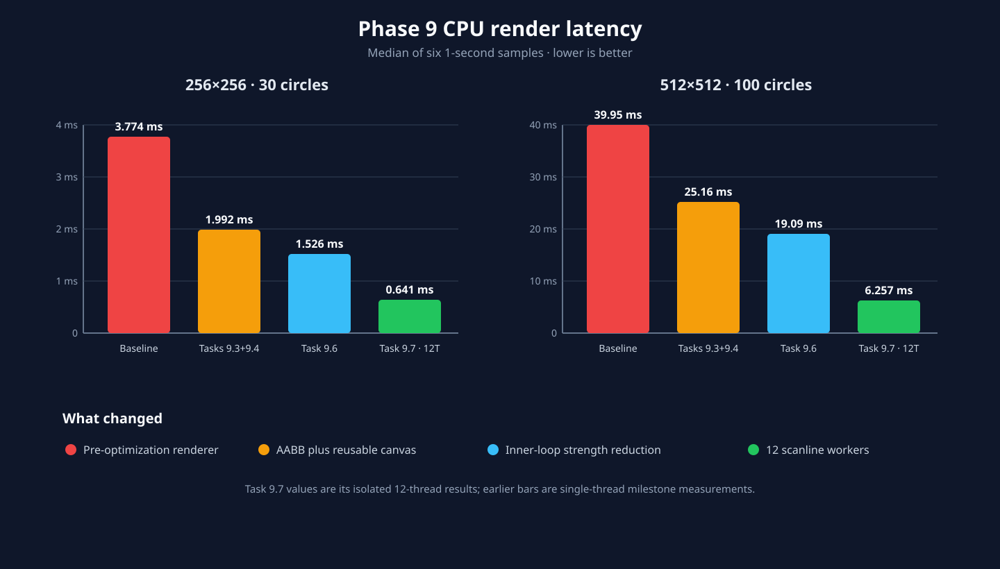
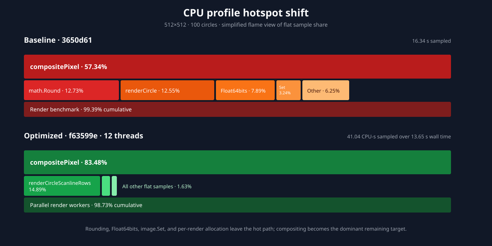

# Phase 9 CPU performance report

**Measured:** 2026-08-12  
**Current revision:** `f63599e`  
**Host:** AMD Ryzen 5 4600H, 6 cores/12 logical CPUs, Linux/amd64  
**Toolchain:** Go 1.26.0, `GOMAXPROCS=12`

## Result

Phase 9 reduced single-thread CPU render latency by **2.47×** at 256×256 with
30 circles and **2.09×** at 512×512 with 100 circles. It also eliminated the
two per-render allocations measured at the pre-optimization baseline. Task 9.7
then improved the 512×512 workload by another **2.96×** using 12 scanline
workers, for a **6.39×** median improvement over the original renderer.



The optimized renderer is still compute-bound. `compositePixel` accounts for
83.48% of flat CPU samples in the current parallel profile; the old
`math.Round`, `math.Float64bits`, `image.Set`, and per-render allocation costs no
longer appear as material hotspots.

## Method

Measurements used temporary detached worktrees at exact milestone commits and
the same deterministic renderer benchmark at every revision. The harness is
preserved under `scripts/profiling/benchmarks/` as `.txt` templates because the
renderer moved from `internal/fit` to `internal/fit/renderer` during later
development.

Each timed benchmark:

- creates its renderer and deterministic parameter vector before timing;
- reuses the same renderer for every iteration;
- measures 256×256/K30 and 512×512/K100;
- records six automatically calibrated, one-second samples with allocations;
- runs all single-thread milestones on the same host and toolchain; and
- uses `benchstat` for median, confidence interval, and significance reporting.

The historical commits are:

| Milestone | Revision | Meaning |
| --- | --- | --- |
| Baseline | `3650d61` | Renderer before Phase 9 CPU optimizations |
| Tasks 9.3+9.4 | `df0bc0c` | AABB/early rejection plus reusable canvas |
| Task 9.6 | `9dfd58d` | Inner-loop strength reduction |
| Before Task 9.7 | `98babd0` | Mature single-thread scanline renderer |
| Task 9.7 | `c53085a` | Configurable scanline sharding |
| Current confirmation | `f63599e` | Current renderer behavior at report time |

`df0bc0c` contains both the Task 9.3 and Task 9.4 code, so the new same-host
benchmark can measure their combined effect but cannot isolate them. Their
individual figures later in this report come from the contemporaneous reports
and are labeled historical rather than being mixed into the new comparison.

Raw benchmark and profile files remain untracked because absolute profiles are
machine- and build-specific. The templates, commit hashes, exact commands, and
published summaries are sufficient to reproduce the experiment.

## Benchmark results

### Single-thread milestones

| Milestone | 256×256/K30 | vs baseline | 512×512/K100 | vs baseline | Allocations/render |
| --- | ---: | ---: | ---: | ---: | ---: |
| Baseline | 3.774 ms | 1.00× | 39.95 ms | 1.00× | 2 |
| Tasks 9.3+9.4 | 1.992 ms | 1.89× | 25.16 ms | 1.59× | 0 |
| Task 9.6 | 1.526 ms | **2.47×** | 19.09 ms | **2.09×** | 0 |
| Before Task 9.7 | 1.437 ms | 2.63× | 18.62 ms | 2.15× | 0 |
| Task 9.7, one thread | 1.470 ms | 2.57× | 18.53 ms | 2.16× | 0 |

`benchstat` reports the Tasks 9.3+9.4 and Task 9.6 reductions versus baseline
as statistically significant for both workloads (`p=0.002`, six samples). The
one-thread results immediately before and after Task 9.7 are statistically
unchanged (`p=0.485` and `p=0.699`), showing that adding parallel support did
not regress the serial path.

The baseline allocated 262,210 B/render at 256×256 and approximately 1.00
MiB/render at 512×512. The reusable canvas reduced both measurements to 0 B/op
and 0 allocs/op in the timed region, a measured 100% hot-path reduction.

### Task 9.7 parallel scaling

| Workload | One thread | 12 threads | Parallel speedup | End-to-end vs baseline |
| --- | ---: | ---: | ---: | ---: |
| 256×256/K30 | 1.470 ms | 0.641 ms | **2.29×** | **5.89×** |
| 512×512/K100 | 18.53 ms | 6.257 ms | **2.96×** | **6.39×** |

The 12-thread path pays 12 small scheduling allocations (720 B/render in the
isolated Task 9.7 benchmark). That trade is worthwhile for these medium and
large cases but remains inappropriate for tiny workloads, as documented in
[CPU rendering threads](cpu-rendering-threads.md).

Current-HEAD confirmation is statistically unchanged from Task 9.7 for every
case. Its medians were 1.496 ms and 17.83 ms for one thread, and 0.643 ms and
5.337 ms for 12 threads; the wider 512×512 parallel variance makes the apparent
difference non-significant (`p=0.132`).

## Per-optimization findings

| Task | Change | Measured conclusion |
| --- | --- | --- |
| 9.3 | AABB precomputation, early rejection, cheaper rounding | Historical report: 1.42× on its optimizer workload. New harness can only measure the combined 9.3+9.4 commit. |
| 9.4 | Reusable canvas and cached background | Historical report: 1.065× and 98.1% fewer allocations. New harness measures 0 B/op and 0 allocs/op after the combined commit. |
| 9.5 | Cache-layout analysis | No implementation change: AoS already matches the renderer's all-fields-per-circle access pattern. |
| 9.6 | Reciprocal multiplication, common-subexpression reuse, offset inlining | New same-host gain over Tasks 9.3+9.4: 1.31× at 256×256 and 1.32× at 512×512. |
| 9.7 | Disjoint scanline sharding | New same-host gain: 2.29× at 256×256 and 2.96× at 512×512 with 12 workers; serial path unchanged. |

Historical optimizer-run timing is not directly comparable to this renderer
microbenchmark. It remains useful as evidence of the original changes, while
the table above uses the new harness wherever the repository history permits a
clean before/after boundary.

## Profile comparison

The matched profiles use the 512×512/K100 case for at least ten seconds. The
baseline profile ran at 45.13 ms/render; the current 12-thread profile ran at
8.60 ms/render under profiling, a 5.25× rate improvement. Profiling overhead
and scheduler sampling make the six-sample benchmark table the authoritative
latency comparison.



| Flat CPU hotspot | Baseline | Current parallel | Direction |
| --- | ---: | ---: | --- |
| `compositePixel` | 57.34% | 83.48% | Larger share of a much faster render; now the dominant target |
| Circle traversal/rasterization | 12.55% | 14.89% | Scanline traversal remains secondary |
| `math.Round` | 12.73% | absent from top profile | Eliminated from the hot path |
| `math.Float64bits` | 7.89% | absent from top profile | Eliminated with rounding change |
| `image.NRGBA.Set` | 3.24% | absent from top profile | Direct buffer access removed the cost |

Interactive self-contained flamegraph captures are available as
[baseline flamegraph](profiles/task-9.9-baseline-flamegraph.html) and
[optimized flamegraph](profiles/task-9.9-optimized-flamegraph.html). They embed
the sampled stacks but not the raw binary profile.

## Remaining bottlenecks

1. **Pixel compositing:** At 83.48% of current CPU samples, horizontal-span
   compositing is the primary candidate for SIMD or carefully validated integer
   arithmetic. This is Phase 10 work, not part of Task 9.9.
2. **Scanline rasterization:** `renderCircleScanlineRows` accounts for 14.89% of
   samples. Changes here should target span setup and preserve pixel parity.
3. **Parallel scheduling and memory bandwidth:** The large workload scales
   2.96× on 12 logical CPUs, not 12×. Worker launch/barrier overhead limits
   medium inputs, while shared-cache and memory bandwidth limit larger inputs.
4. **Tiny-workload policy:** Parallel rendering can lose to the serial path when
   useful work is smaller than synchronization overhead. Automatic selection
   would need benchmark-backed thresholds across more CPUs; explicit
   `--threads 1` remains the predictable control.

Cost computation is not a renderer-profile hotspot. `FastMSECost` has its own
canonical cases in [the benchmark suite](benchmarks.md), including scalar and
runtime-dispatched SIMD behavior.

## Reproduction

Copy the matching template into a detached worktree, run the benchmark, then
remove the copied test file. For pre-package-split milestones:

```sh
cp scripts/profiling/benchmarks/phase9_legacy_test.go.txt \
  /path/to/worktree/internal/fit/phase9_measure_test.go
cd /path/to/worktree
GOMAXPROCS=12 go test -run '^$' -bench '^BenchmarkPhase9Render$' \
  -benchmem -benchtime=1s -count=6 ./internal/fit
```

For modern renderer milestones, copy `phase9_renderer_test.go.txt` into
`internal/fit/renderer/phase9_measure_test.go` and benchmark
`./internal/fit/renderer`. Capture a profile by selecting one sub-benchmark:

```sh
GOMAXPROCS=12 go test -run '^$' \
  -bench '^BenchmarkPhase9Parallel/512x512_K100$' -benchtime=10s \
  -cpuprofile=/tmp/mayfly-phase9-cpu.prof ./internal/fit/renderer
go tool pprof -top /tmp/mayfly-phase9-cpu.prof
go tool pprof -http=localhost:0 /tmp/mayfly-phase9-cpu.prof
```

The repository pins pprof as a Go tool, so these commands do not depend on a
separately installed or toolchain-bundled executable.
